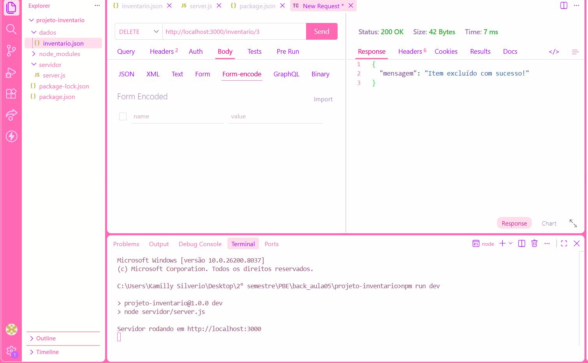
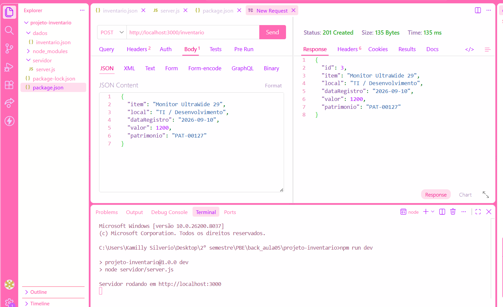
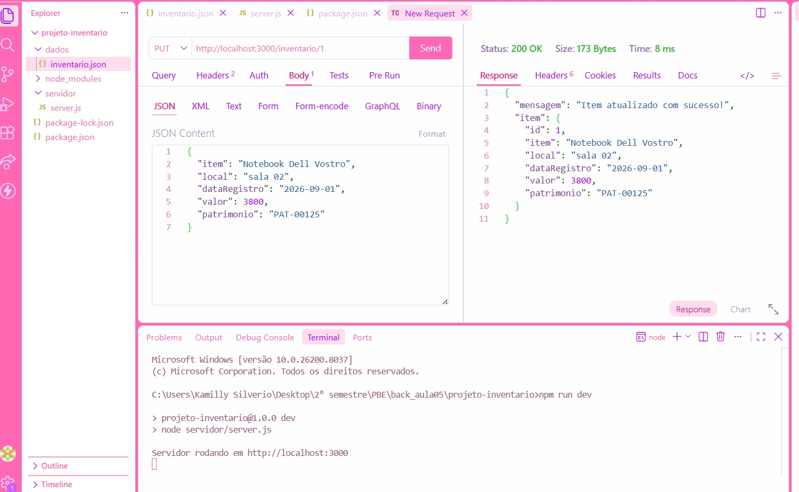
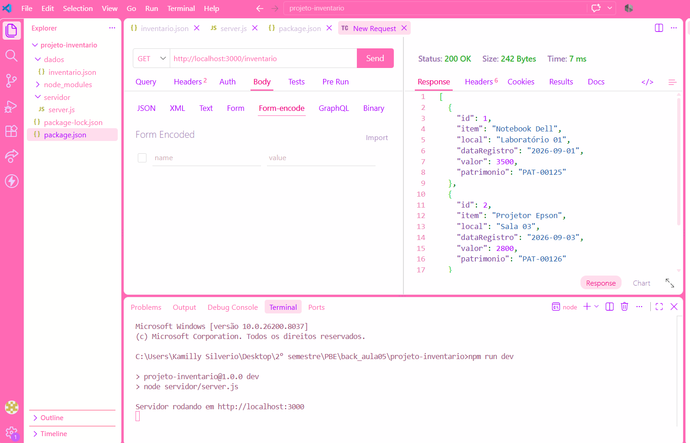

# aula05_backend

# API de Inventário de Patrimônio

Projeto desenvolvido para a aula de PBE. Consiste em uma API RESTful para gerenciamento de inventário, com dados armazenados em arquivo JSON.

## Execução do Projeto

1. Instalar as dependências:
npm install

2. Iniciar o servidor:
npm run dev

O servidor rodará em: http://localhost:3000

## Tecnologias Utilizadas

- Node.js e Express
- File System (fs) para escrita e leitura em dados/inventario.json
- Thunder Client para testes de integração

## Rotas da API e Testes

### 1. Listar Itens (GET /inventario)
Retorna todos os itens do arquivo de dados.
Status: 200 OK

---

### 2. Cadastrar Item (POST /inventario)
Insere um novo registro no inventário.
Status: 201 Created

---

### 3. Atualizar Item (PUT /inventario/:id)
Altera os dados de um item existente pelo ID.
Status: 200 OK

---

### 4. Excluir Item (DELETE /inventario/:id)
Remove um item do inventário pelo ID.
Status: 200 OK

---

### 5. Rotas Adicionais

- GET /inventario/:id - Busca item por ID (200 OK / 404 Not Found)
- GET /inventario/valor-total - Soma do valor total dos bens
- GET /inventario?nome=...&local=... - Filtro por parâmetros de busca
